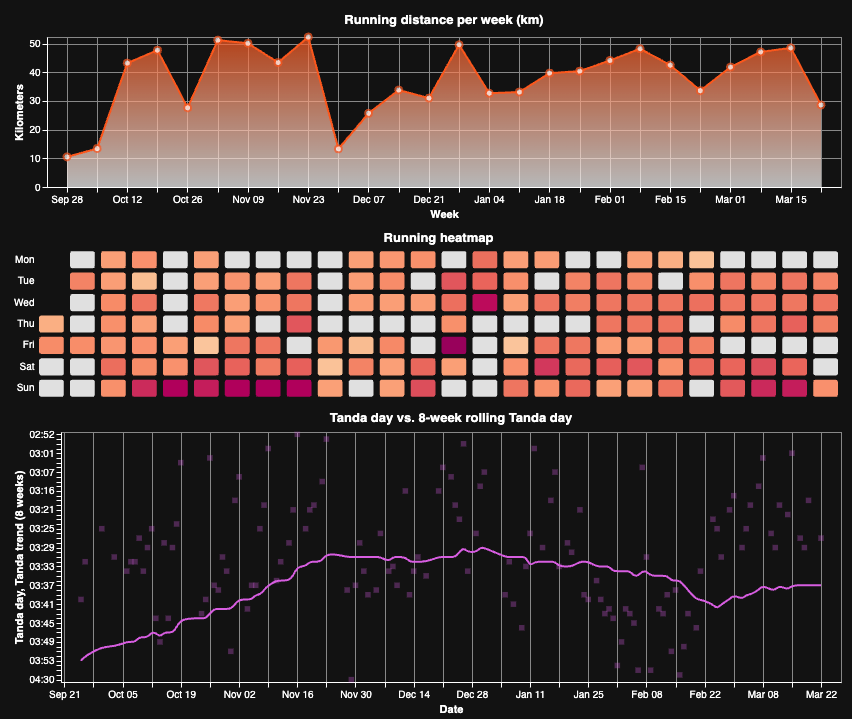

# Tanda Runner

An opinionated running dashboard.

[](https://tandarunner.duarteocarmo.com)

## Development

This project uses [uv](https://docs.astral.sh/uv/) for dependency management.

1. Install dependencies:

```bash
make install
```

2. Run checks:

```bash
make check
```

3. Run tests:

```bash
make test
```

4. Run the app locally:

```bash
make run
```

5. See all commands:

```bash
make help
```
